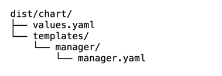

## v1
### Create a project
kubebuilder init --domain tutorial.kubebuilder.io --repo tutorial.kubebuilder.io --project-name multiversion-tutorial

INFO Writing kustomize manifests for you to edit...
INFO Writing scaffold for you to edit...
INFO Get controller runtime:
$ go get sigs.k8s.io/controller-runtime@v0.20.2
INFO Update dependencies:
$ go mod tidy
Next: define a resource with:
$ kubebuilder create api
### Adding a new API
kubebuilder create api --group batch --version v1 --kind CronJob

INFO Create Resource [y/n]                        
y
INFO Create Controller [y/n]                      
y
INFO Writing kustomize manifests for you to edit...
INFO Writing scaffold for you to edit...          
INFO api/v1/cronjob_types.go                      
INFO api/v1/groupversion_info.go                  
INFO internal/controller/suite_test.go            
INFO internal/controller/cronjob_controller.go    
INFO internal/controller/cronjob_controller_test.go
INFO Update dependencies:
$ go mod tidy           
INFO Running make:
$ make generate                
mkdir -p /Users/yaolong/Documents/gitProject/github/yao560909/multiversion-tutorial/bin
Downloading sigs.k8s.io/controller-tools/cmd/controller-gen@v0.17.2
/Users/yaolong/Documents/gitProject/github/yao560909/multiversion-tutorial/bin/controller-gen object:headerFile="hack/boilerplate.go.txt" paths="./..."
Next: implement your new API and generate the manifests (e.g. CRDs,CRs) with:
$ make manifests

### Implementing a controller
cronjob_types.go
cronjob_controller.go

### make manifests
config/rbac/role.yaml
config/crd/bases/

### Implementing defaulting/validating webhooks
kubebuilder create webhook --group batch --version v1 --kind CronJob --defaulting --programmatic-validation

INFO Writing kustomize manifests for you to edit...
INFO Writing scaffold for you to edit...          
INFO internal/webhook/v1/cronjob_webhook.go       
INFO internal/webhook/v1/cronjob_webhook_test.go  
INFO internal/webhook/v1/webhook_suite_test.go    
INFO Update dependencies:
$ go mod tidy           
INFO Running make:
$ make generate                
/Users/yaolong/Documents/gitProject/github/yao560909/multiversion-tutorial/bin/controller-gen object:headerFile="hack/boilerplate.go.txt" paths="./..."
Next: implement your new Webhook and generate the manifests with:
$ make manifests

### webhooks
cronjob_webhook.go

### make manifests

config/webhook/manifests.yaml

### make build-installer
make build-installer IMG=127.0.0.1:30443/ict/cronjob-operator:latest
/Users/yaolong/Documents/gitProject/github/yao560909/multiversion-tutorial/bin/controller-gen rbac:roleName=manager-role crd webhook paths="./..." output:crd:artifacts:config=config/crd/bases
/Users/yaolong/Documents/gitProject/github/yao560909/multiversion-tutorial/bin/controller-gen object:headerFile="hack/boilerplate.go.txt" paths="./..."
mkdir -p dist
cd config/manager && /Users/yaolong/Documents/gitProject/github/yao560909/multiversion-tutorial/bin/kustomize edit set image controller=127.0.0.1:30443/ict/cronjob-operator:latest
/Users/yaolong/Documents/gitProject/github/yao560909/multiversion-tutorial/bin/kustomize build config/default > dist/install.yaml

### helm plugin
#kubebuilder init --plugins=helm/v1-alpha
kubebuilder edit --plugins=helm/v1-alpha

Tips:
Note that the following files will not be updated unless you use the --force flag:

The files chart/Chart.yaml, chart/templates/_helpers.tpl, and chart/.helmignore are never updated after their initial creation unless you remove them.

### samples
Create samples batch_v1_cronjob.yaml

## v2

### Adding a new API v2

kubebuilder create api --group batch --version v2 --kind CronJob

Tips:
Press y for “Create Resource” and n for “Create Controller”.

INFO Create Resource [y/n]                        
y
INFO Create Controller [y/n]                      
n
INFO Writing kustomize manifests for you to edit...
INFO Writing scaffold for you to edit...          
INFO api/v2/cronjob_types.go                      
INFO api/v2/groupversion_info.go                  
INFO Update dependencies:
$ go mod tidy           
INFO Running make:
$ make generate                
/Users/yaolong/Documents/gitProject/github/yao560909/multiversion-tutorial/bin/controller-gen object:headerFile="hack/boilerplate.go.txt" paths="./..."
Next: implement your new API and generate the manifests (e.g. CRDs,CRs) with:
$ make manifests

### make manifests

config/crd/bases/batch.tutorial.kubebuilder.io_cronjobs.yaml

### Implementing conversion

kubebuilder create webhook --group batch --version v1 --kind CronJob --conversion --spoke v2 --force

Tips:
--force                        attempt to create resource even if it already exists

INFO Writing kustomize manifests for you to edit...
INFO Writing scaffold for you to edit...          
INFO internal/webhook/v1/cronjob_webhook.go       
INFO internal/webhook/v1/cronjob_webhook_test.go  
INFO api/v1/cronjob_conversion.go                 
INFO Scaffolding for spoke version: v2            
INFO Creating spoke conversion file at: api/v2/cronjob_conversion.go
INFO Webhook server has been set up for you.
You need to implement the conversion.Hub and conversion.Convertible interfaces for your CRD types.
INFO Update dependencies:
$ go mod tidy           
INFO Running make:
$ make generate                
/Users/yaolong/Documents/gitProject/github/yao560909/multiversion-tutorial/bin/controller-gen object:headerFile="hack/boilerplate.go.txt" paths="./..."
Next: implement your new Webhook and generate the manifests with:
$ make manifests

